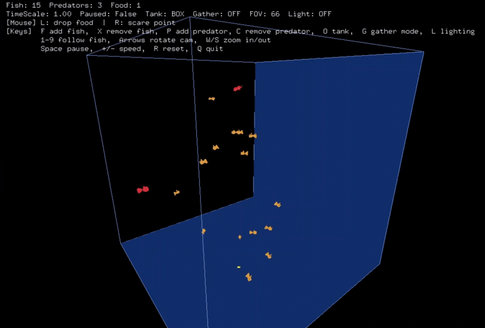
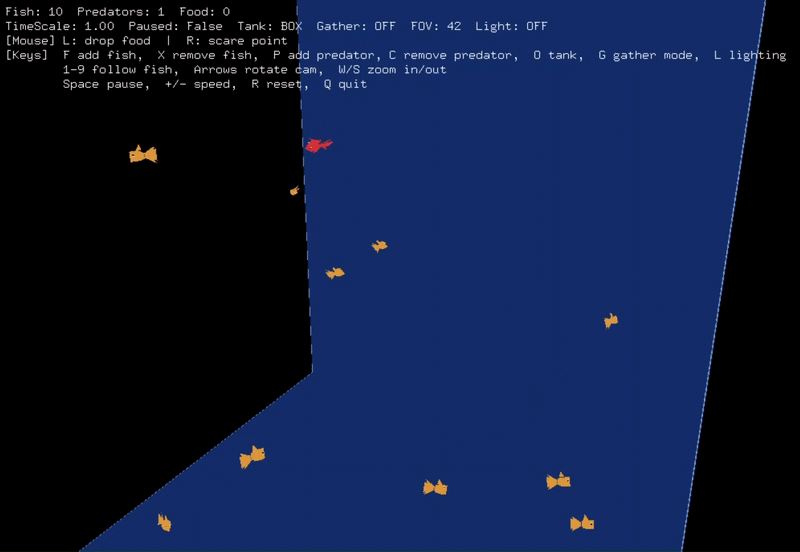
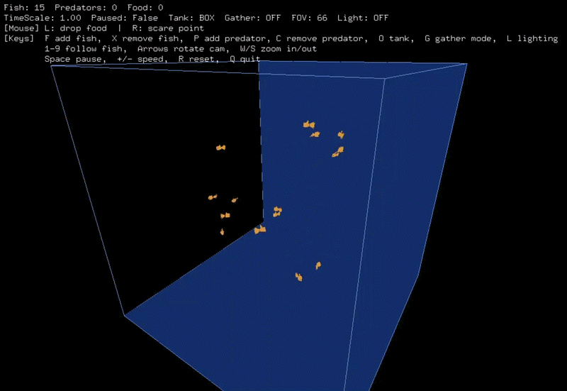
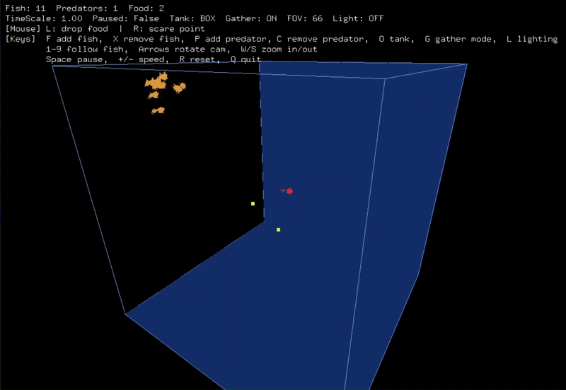

## Overview

A real-time 3D aquarium simulation built with Python and PyOpenGL, combining autonomous agents, flocking behavior, predator-prey dynamics, and interactive environmental events.

The simulation was built from scratch using immediate-mode OpenGL, with the ecosystem governed by interacting behavioral rules rather than scripted movement.



---

## Features

- **Boids-based flocking**: fish exhibit alignment, cohesion, and separation to produce emergent shoaling behavior.
- **Predator-prey dynamics**: predators pursue fish while fish respond to nearby threats.
- **Hunger and survival**: entities must find food or prey within a limited hunger window or eventually die.
- **Interactive feeding**: food can be dropped into the tank and attracts nearby fish.
- **Scare events**: interactive disturbances startle and scatter nearby entities.
- **Gather mode**: fish organize around a dynamically selected leader to form a tighter shoal.
- **Dynamic environments**: switch between box and cylindrical tank geometries and multiple lighting presets.
- **Free-look camera**: orbit, zoom, and follow individual fish in real time.
- **Live simulation HUD**: displays population, simulation speed, tank configuration, camera state, and lighting information.

---

## Demos

| Behavior | Preview |
|---|---|
| Predator-prey motion |  |
| Gather mode |  |
| Scare event |  |

---

## How It Works

### Flocking
Each fish continuously calculates steering forces based on its surroundings:

- **Alignment**: match the heading of nearby fish
- **Cohesion**: move toward the local group
- **Separation**: avoid collisions with nearby fish
- **Wall avoidance**: remain within the tank
- **Food attraction**: seek nearby food
- **Predator avoidance**: flee from nearby predators

The combination of these local rules produces collective flocking behavior without explicitly defining the movement of the group as a whole.

### Predators
Predators use a similar steering framework, but pursue nearby fish rather than food. Successful predation resets their hunger state and changes the population dynamics of the ecosystem.

### Hunger and Survival
Fish and predators continuously accumulate hunger. If an entity fails to feed within its survival window, it dies and sinks toward the tank floor before being removed from the simulation.

### Gather Mode
Gather mode introduces an additional organizational behavior. A leader is dynamically selected from the flock, while other fish are assigned target distances around it.

The resulting interaction between the leader-following behavior and the existing flocking rules produces a more organized shoal while retaining individual movement.

### Interactive Events
The environment can be modified during simulation:

- **Food drops** attract nearby fish.
- **Scare points** apply an outward impulse to nearby entities, producing a visible startle response.

---

## Implementation

The simulation combines several interacting systems:

```text
Individual steering rules
 │
 ▼
Fish behavior
 │
 ▼
Flocking dynamics
 │
 ▼
Predator-prey interactions
 │
 ▼
Hunger / survival
 │
 ▼
Emergent ecosystem behavior
```

Rendering, animation, camera control, interaction, and simulation logic are implemented directly in Python using PyOpenGL.

---

## Controls

| Input | Action |
|---|---|
| Left click | Drop a food pellet at the clicked location in the tank |
| Right click | Trigger a scare point (startles nearby fish/predators) |
| `F` | Add a fish (up to max population) |
| `X` | Remove a fish |
| `P` | Add a predator |
| `C` | Remove a predator |
| `O` | Toggle tank shape (Box <-> Cylinder) |
| `G` | Toggle gather mode |
| `L` | Cycle lighting preset |
| `1`-`9` | Follow the corresponding fish with the camera |
| Arrow keys | Rotate camera (orbit) |
| `W` / `S` | Zoom in / out (adjusts FOV) |
| `Space` | Pause / resume simulation |
| `+` / `-` | Increase / decrease simulation speed |
| `R` | Reset the world |
| `Q` | Quit |

---

## Future Directions

Potential extensions include:

* Migrating from immediate-mode OpenGL to modern shader-based rendering
* Spatial partitioning for larger populations
* Configurable simulation parameters
* More physically based lighting
* Sound and environmental effects